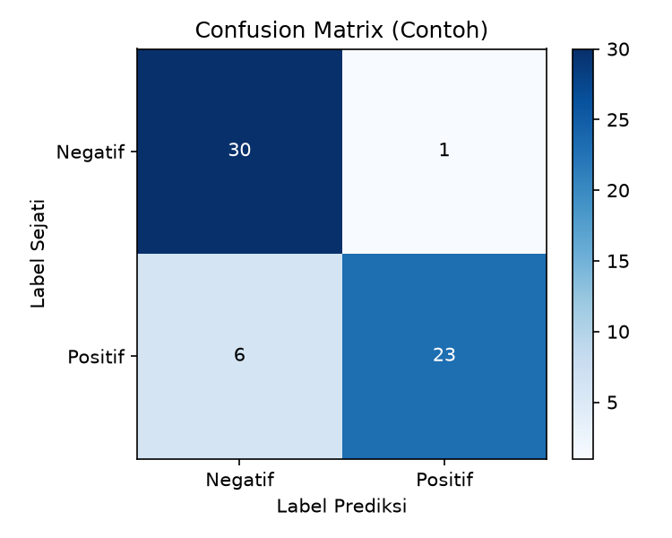
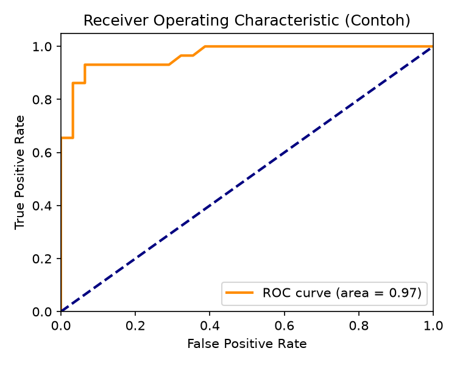

# Results

## Marketing
- **Model**: Random Forest
- **Accuracy**: 94%
- **Key Finding**: Konten Reels meningkatkan keterlibatan sebesar 71% dibandingkan Post.
- **Implication**: Alokasi anggaran pemasaran harus lebih berfokus pada produksi Reels.

## SDM (Human Resources)
- **Model**: Decision Tree
- **Accuracy**: 77%
- **Key Finding**: Ketidakhadiran (absensi) adalah faktor dominan yang mempengaruhi kinerja staf.
- **Implementasi**: Programa pelatihan dan insensitif kehadiran dapat meningkatkan kinerja secara signifikan.

## Operasional
- **Model**: SVM + k-NN
- **Accuracy**: 82%
- **Key Finding**: 13,6% transaksi pengadaan diklasifikasikan sebagai tidak efisien.
- **Potensi Penghematan**: Estimasi penghematan sebesar Rp2,3 juta per bulan melalui audit vendor, renegosiasi kontrak, atau penggantian supplier.

## Visualisasi Hasil

### Confusion Matrix (Contoh)

### ROC Curve (Contoh)

## Ringkasan
Tiga model klasifikasi berhasil mengidentifikasi faktor kritis dalam masing-masing domain, memberikan dasar untuk rekomendasi strategis yang dapat meningkatkan efektivitas marketing, kinerja SDM, dan efisiensi operasional kampus.